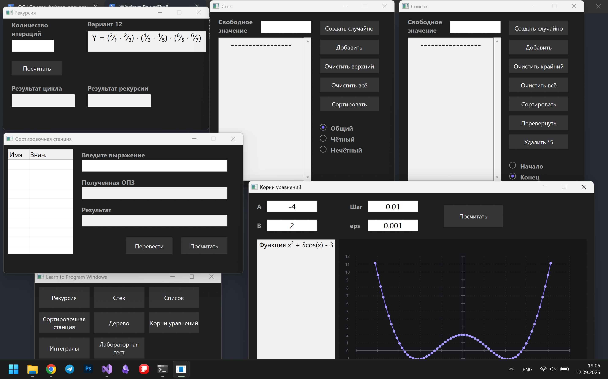

# GUI лабораторные на WinAPI

<video src="https://github.com/user-attachments/assets/e6afc745-ccaa-4a33-bb24-e0ea08d6acf3" controls ></video>

# Настройки проекта

- Стандарт языка C++: ISO C++20 (/std:c++20)

## Манифест
- Поддержка высокого DPI

## Библиотеки

[ssstl](https://github.com/Danik2395/ssstl) - написаная мной stl like библиотека

- В ssstl::random подключается `windows.h`, в котором убирается флаг юникода, поэтому его нужно определить в `CMakeListts.txt`

# Лабораторные

## 1. Рекурсия
						
**Вариант 12:** Вычислить произведение четного количества n (n > 2) сомножителей следующего вида: Y = (²⁄₁ · ²⁄₃) · (⁴⁄₃ · ⁴⁄₅) · (⁶⁄₅ · ⁶⁄₇)

- [Код](Lab1WIndow.cpp)

По умолчанию поставит 2 множителя. Даёт ввести только одно число

## 2. Стек

**Вариант 12:** Созданный список разделить на два: в первый поместить четные, а во второй – нечетные числа

- [Односвязный список](https://github.com/Danik2395/ssstl/blob/main/README.md/#singlenodelist)
- [Стек](https://github.com/Danik2395/ssstl/blob/main/README.md/#stack)
- [Применение](Lab2Window.cpp)

### Свободное значение:

Не влияет на удаление верхнего элемента и сортировку

**Пусто**
- Создать случайно
	- Выберет случайное число от 5 до 15 и создаст стек, состоящий из случайных чисел от -1000000 до 1000000, размером равный выбранному значению
- Добавить
	- Ничего не будет

**Одно число**
- Создать случайно
	- Создаст стек случайных чисел, размером равный введённому значению не больше 100 элементов
- Добавить
	- Добавит введённое значение в стек

**Несколько чисел**
- Создать случайно
	- [Приведёт](#mainedit) числа к одному и создаст случайный стек
- Добавить
	- Добавит введённые числа в стек

**Очистить всё**
- Очистит поле ввода свободного значения и поле вывода

### Радио кнопки:
- По умолчанию выбрана кнопка "Общий"
	- При очистке всего будет выбрана она же
- При переключении с "Общий" на "Чётный" или "Нечётный" стек разделяется на чётную и нечётную части
- При переключении с "Чётный" или "Нечётный" на "Общие" стек соединяется в один
	
**Общий**
- Все операции со стеком направлены на основной стек

**Чётный**
- Все операции со стеком направлены на чётную часть стека

**Нечётный**
- Все операции со стеком направлены на нечётную стека

## 3. Список

**Вариант 5:** Из созданного списка удалить элементы, заканчивающиеся на цифру 5 

- [Двусвязный список](https://github.com/Danik2395/ssstl/blob/main/README.md/#list)
- [Применение](Lab3Window.cpp)

## 4. Сортировочная станция

- [VariablesListView](#variableslistview)
- [Shunting Yard](#shunting-yard)
- [Применение](Lab4Window.cpp)

## 5. Дерево

**Вариант 13:** Между максимальным и минимальным значениями ключей найти запись с ключом  со значением, ближайшим к среднему значению

- [Дерево](https://github.com/Danik2395/ssstl/blob/main/README.md/#mapletree)
- [Применение](Lab5Window.cpp)

## 6. Поиск корней уравнений

**Вариант 12:**

|Вид функции|Заданный метод|
|---|---|
|x² + 5cos(x) - 3|Метод Ньютона|

- [Нелинейные уравнения](#nolinearsolver)
- [Применение](Lab6Window.cpp)

## 8. Алгоритмы вычисления интегралов

**Вариант 12:**

|Вид функции|Метод интегрирования|
|---|---|
|x² + 5cos(x)|Метод Гаусса3|

- [Интегралы](#integralsolver)
- [Применение](Lab8Window.cpp) 

# Окна интерфейса

## Шаблоны

### [BaseWindow](BaseWindow.h)
- Первый в каскаде
- Создаёт окно и регистрирует класс
- "Кладёт" в окно указатель на его класс
- **pThis**
	- Легаси коду в `RegisterClass()` нужна конкретная сигнатура с 4-мя параметрами
	- Метод создаёт 5-й параметр `this`
	- Обходим это `static` на `WindowProc`
- Обрабатывает 
	- `MW_DESTROY` 
	- И вызывает `DefWindowProc` на дефолт свича

### [D2DWindow](D2DWindow.h)
- Наследуется от [`BaseWindow`](#basewindow)
- Добавляет Direct2D и DirectWrite
- Создаёт
	- `ID2D1Factory`
	- `ID2D1HwndRenderTarget`
	- `IDWriteFactory`
	- Объект класса [`DpiScale`](#dpiscale)
		- Макрос `S()` для скейла
- `CreateGraphicsResources()`
	- Вызывает `virtual CreateDeviceDepRec()` для создания ресурсов для конкретных окон
- `OnPaint`
	- Инициализирует рисование
	- И вызывает `DrawContent` для отрисовки реализованной в конкретных окнах
- Обрабатывает
	- `WM_PAINT`
	- `WM_CREATE`
	- `WM_SIZE`
	- И отдаёт дефолт в `BaseWindow`

### [MainWindow](MainWindow.h)
- Наследуется от [`D2DWindow`](#d2dwindow)
- Обрабатывает 
	- `WM_SETCURSOR`
	- И отдаёт дефолт в `MainWindow`
- Рисует шумный фон

### [ScrollWindowBase](ScrollWindowBase.h)
- Наследуется от 
	- [`D2DWindow`](#d2dwindow)
- Реализует
	- [`IControl`](#icontrol)
- Умный шаблон
	- Нужно переопределить только отрисовку контента
- Использует `D2D1::Matrix3x2F::Translation()` для перемещения клиентских координат
- Скролбар через `SCROLLINFO`

---

## Вспомогательные классы и функции

### [DpiScale](DpiScale.h)
- Создаётся для каждого окна
	- Композиция
- Переводит DIPs в физические пиксели и наоборот
- Имеет `static` метод для скейла по дефолтным настройкам системы
	- Там, где окно ещё не создано

### [ThreadLauncher](ThreadLauncher.h) (**функция**)
- Создаёт новое окно заданного класса в отдельном потоке
	- В	случае,если сущностей окна не больше заданного числа
	- Свой цикл сообщений

### [WndProps](WndProps.h)
- Наследуется Parent окнами
	- В конструкторе окна вызывается конструктор `WndProps`
- Содержит для каждого окна
	- Размеры
	- Начальное положение
	- Имя
- "Перегрузка" для _дефолтного_ значения количества окон
	- Не добавляет логику проверки количества окон
	- Метод проверки возвращает 0
	- Конструкторы наследуются
- "Перегрузка" для _произвольного_ значения количества окон
	- Принимаемые конструктором параметры произвольного количества передаются в родительский конструктор

### [IControl](IControl.h)
- Чисто виртуальный класс
- Можно было и без него, но чтобы был `Move()` в каждом контроле

---

## Окна-контролы

Почему нет BaseControl?

Потому что для лабораторных это Овер инжиниринг. 
Вычленять, что у них там общее, и потом запоминать, 
какая же переменная была базовой, а какая нет, будет сложно.

### [MainButton](Mainbutton.h)
- Наследуется от 
	- [`D2DWindow`](#d2dwindow)
- Реализует
	- [`IControl`](#icontrol)
- Окно-кнопка
- Создаёт себя через `BaseWindow::Create()` с заданными параметрами
- Рисует
	- Себя
	- Текст
- Обрабатывает
	- `WM_SETCURSOR`
	- Одиночные нажатия
		- Отправляет сообщение о нажатии
		- "Кладёт" id в lowWord `wParam`

### [MainCheckBox](MainCheckBox.h)
- Наследуется от 
	- [`D2DWindow`](#d2dwindow)
- Реализует
	- [`IControl`](#icontrol)
- Окно-чекбокс
- Работает как кнопка, но имеет состояние `isSelected`

### [MainEdit](MainEdit.h)
- Реализует
	- [`IControl`](#icontrol)
- Обёртка для `EDIT` с использование сабклассинга
- Создаёт
	- Окно класса `EDIT`
	- C заданными флагами стиля
	- С заданными параметрами
	- C текстом, [скейленым](#dpiscale) под DPI
- Может
	- `SetText()`
	- `GetText()`
- Нужен windows style `\r\n` для перехода на новую строку
- Сабкласс
	- Сабкласс на сам контрол
		- Обрабатывает нажатия на Return и Escape
	- Сабкласс на родительское окно
		- Слушает сообщение о нажатии левой кнопкой на родителя и отдаёт ему фокус

### [MainRadioButton](MainRadioButton.h)
- Реализует
	- [`IControl`](#icontrol)
- Самый не Windows контрол
	- Всё есть окно. Окно есть прямоугольник. Кнопка круглая.
- GDI обрезка окна
	- Подогнано, чтобы не было видно рваного контура и была видна полезная область
	- Костыль, но сделать размытие по альфе на WS_CHILD сложнее
- Группа задаётся параметром в шаблоне
- Переделанный чекбокс
	- Так же отправляет сообщения на нажатии
		- А также перерисовывает предыдущую нажатую кнопку
	- Но имеет `static` поле с id нажатой кнопки
- Можно
	- Проверить не только состояние самой кнопки, но и какая кнопка сейчас нажата
	- Установить произвольную кнопку во включённое состояние

### [VariablesListView](VariablesListView.h)
- Реализует
	- [`IControl`](#icontrol)
- Обёртка над `ListView` с использование сабклассинга
- Является таблицей вида `|Имя|Значение|` для ввода значений переменных
- Имеет методы для
	- Добавления колонок/строк
	- Удаления колонок/строк

### [TreeDrawer](TreeDrawer.h)
- Наследуется от [ScrollWindowBase](#scrollwindowbase)
- Хранит данные об узлах и соединениях для отрисовки
- Обновлять данные при добавлении элементов в дерево

### [PlotWindow](PlotWindow.h)
- Наследуется от 
    - [`D2DWindow`](#d2dwindow)
- Реализует
    - [`IControl`](#icontrol)
- Шаблонное окно для отрисовки графика функции
- Принимает функцию через параметр шаблона и проверяет её сигнатуру через concept
- Рисует координатную сетку, оси с подписями и кривую функции через `ID2D1PathGeometry`
- Управление областью видимости через xMin/xMax/yMin/yMax и количество точек для построения

---

## Конкретные окна

### [HubWindow](HubWindow.h)
- Наследуется от 
	- [`MainWindow`](#mainwindow)
- Реализует
	- [`WndProps`](#wndprops)
- Расставляет кнопки для создания окон лабораторных

### Все окна Лабораторных
- Наследуется от 
	- [`MainWindow`](#mainwindow)
- Реализует
	- [`WndProps`](#wndprops)
- Кнопки
- Едиты
- Чекбоксы

# Алгоритмы

## [Shunting Yard](shuntingYard.h)
- Стандартная сортировочная станция Дейкстры, но с обработкой исключений
- `throw shuntingExeption()` на все исключения
	- Нужно, потому что стандартный `std::exeption` не работает с `wchar_t`
- Для работы нужно передать входную строку и переменные, если они есть
	- Переменные нужно передать в листе типа `shuntingYard::Variables`
	- Входная строка будет разложена на токены (операнды и операторы)
- `OperatorHandler` потому что нет `std::map`

## [NoLinearSolver](NoLinearSolver.h)
- Решение нелинейных уравнений методом Ньютона (касательных)
- `throw noLinearException()`
- Хранит функцию и производную функции
- Сеттеры для эпсилон и функций
- `FindIntervals()` возвращает контракт `IntervalsList = List<Pair<double, double>>`
- `SolveNewton()` применяется для каждого интервала из `IntervalsList`

## [IntegralSolver](IntegralSolver.h)
- Вычисление определённых интегралов методом Гаусса (3 узла)
- `throw integralException()`
- Хранит функцию и точность (`epsilon_`)
- Сеттеры для эпсилон и функции
- `SolveGauss3()`
	- прямое вычисление с заданным числом разбиений
- `SolveGauss3Auto()`
	- автоматическое удвоение разбиений до достижения точности
	- возвращает `Pair<double, int>`, где double интеграл, int - количество разбиений

# [Утилиты](Utils.h)

## `inline UTL::GetNumber()`
- Переводит строку в число, отсеивая всё, что не может являться позиционной записью числа
- Проверяет лимиты правильного чтения числовых типов
